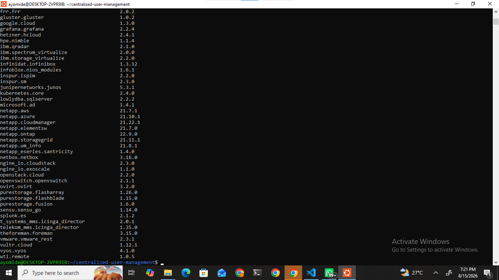
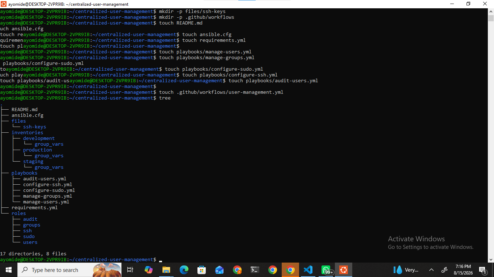
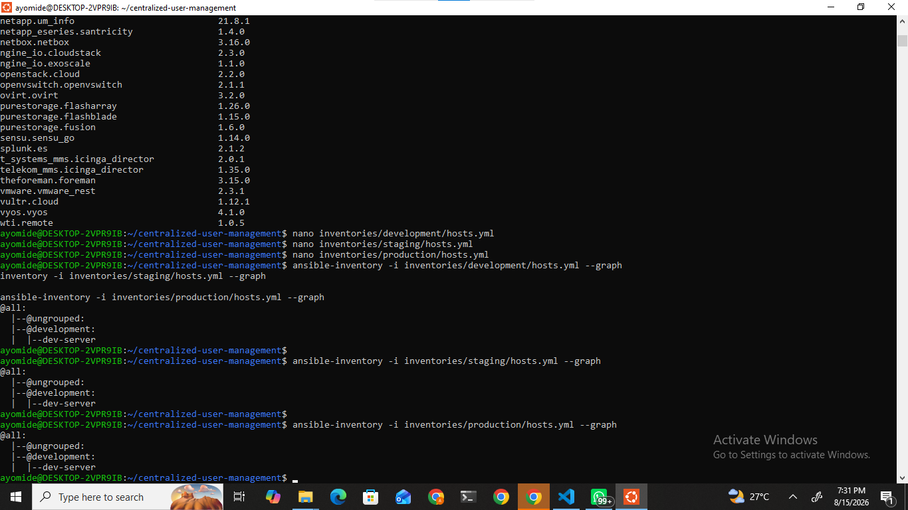
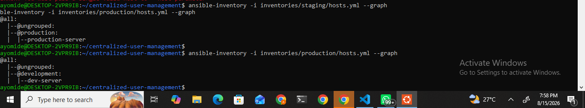
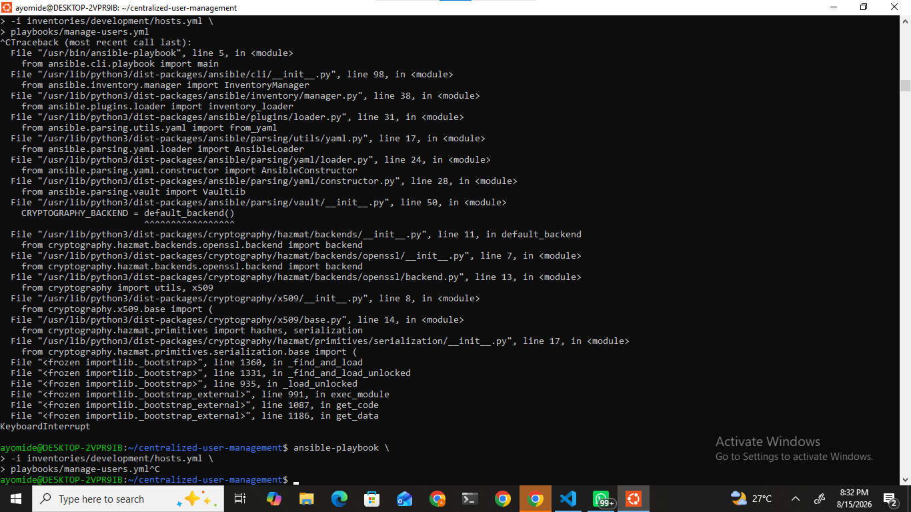
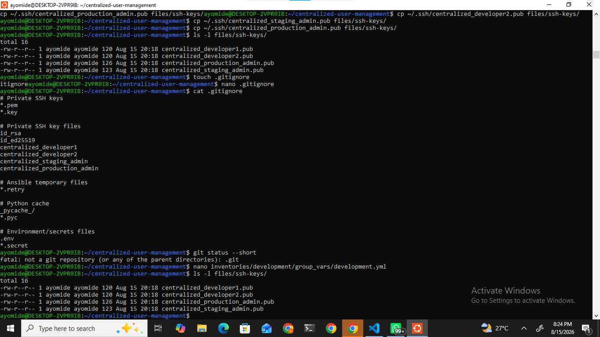
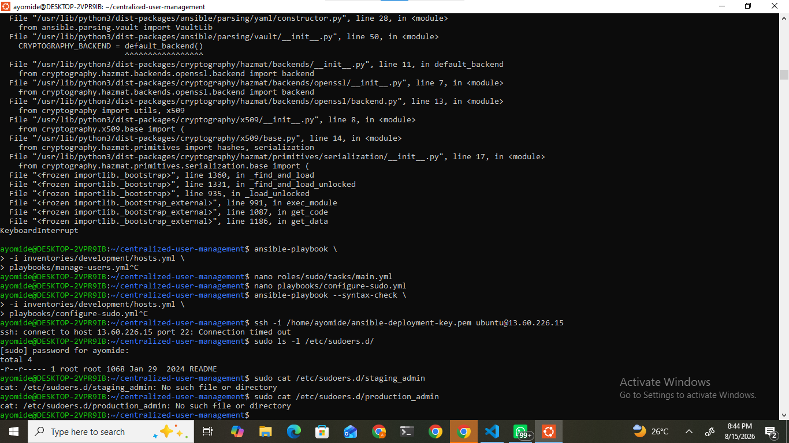

# Critical Thinking Project 6
## Centralized User and Permission Management with Ansible

**Centralized, idempotent Linux identity and access management across Development, Staging, and Production environments using Ansible.**

This project implements a structured DevOps automation solution for consistent user lifecycle management, role-based access control (RBAC), SSH public-key authentication, and environment-specific sudo privileges. It demonstrates inventory separation, reusable roles, configuration-as-code practices, and preparation for CI/CD integration while adhering to least-privilege and security best practices.

---

## Table of Contents

1. [Project Scenario](#1-project-scenario)
2. [Project Objectives](#2-project-objectives)
3. [Environment Access Model](#3-environment-access-model)
4. [Technology Stack](#4-technology-stack)
5. [Repository Structure](#5-repository-structure)
6. [Inventory Architecture](#6-inventory-architecture)
7. [Environment Variables](#7-environment-variables)
8. [User Management Role](#8-user-management-role)
9. [SSH Key Management](#9-ssh-key-management)
10. [Role-Based Sudo Management](#10-role-based-sudo-management)
11. [Playbooks](#11-playbooks)
12. [Security Practices](#12-security-practices)
13. [Automation and CI/CD](#13-automation-and-cicd)
14. [Auditing and Logging](#14-auditing-and-logging)
15. [Testing and Validation](#15-testing-and-validation)
16. [Screenshot Evidence](#16-screenshot-evidence)
17. [Documentation Evidence Note](#17-documentation-evidence-note)
18. [Troubleshooting Guide](#18-troubleshooting-guide)
19. [How to Add a New User](#19-how-to-add-a-new-user)
20. [How to Remove a User](#20-how-to-remove-a-user)
21. [How to Run the Project](#21-how-to-run-the-project)
22. [Idempotency](#22-idempotency)
23. [Lessons Learned](#23-lessons-learned)
24. [Future Improvements](#24-future-improvements)
25. [Conclusion](#25-conclusion)

---

## 1. Project Scenario

This project simulates a real-world organizational requirement in which a DevOps engineer is responsible for centralizing and automating Linux user and permission management across multiple environments.

The organization operates three distinct environments:

- **Development**
- **Staging**
- **Production**

Each environment has different access and privilege requirements. The automation solution is designed to:

- Create Linux users consistently across environments
- Create and manage user groups
- Deploy SSH public keys for key-based authentication
- Configure environment-specific privileges
- Assign sudo privileges according to defined user roles
- Remove users when they are no longer required
- Support repeatable and idempotent configuration management
- Provide basic auditing and security controls
- Prepare the project for CI/CD automation through GitHub Actions

The implementation uses Ansible as the configuration management engine, with clearly separated inventories, group variables, and reusable roles.

---

## 2. Project Objectives

1. **Centralize Linux user management using Ansible**  
   Eliminate manual, error-prone user administration by defining desired state in version-controlled configuration.

2. **Standardize user and group configuration across environments**  
   Ensure consistent naming, group membership, shell, and home directory settings while allowing environment-specific differences.

3. **Implement role-based access control**  
   Map users to groups and apply privileges according to role rather than individual exceptions.

4. **Use SSH key-based authentication**  
   Deploy public keys via Ansible and enforce key-only access where possible.

5. **Restrict sudo privileges according to environment and role**  
   Apply least privilege: no sudo in Development for regular developers, limited sudo in Staging, and tightly controlled full sudo only for Production administrators.

6. **Allow users to be added or removed through configuration changes**  
   New users and removals are driven by updates to group_vars rather than ad-hoc commands.

7. **Structure Ansible inventories separately for Development, Staging, and Production**  
   Prevent accidental cross-environment changes and make environment differences explicit.

8. **Maintain reusable Ansible roles**  
   Encapsulate user, group, SSH, sudo, and audit logic into roles for maintainability and reuse.

9. **Follow security best practices**  
   Protect private keys, avoid secrets in source control, validate sudoers, and apply least privilege.

10. **Provide documentation and evidence of implementation**  
    Document architecture, procedures, and validation so the solution is reproducible and mentor-ready.

11. **Prepare the repository for automated CI/CD execution**  
    Structure the project so GitHub Actions can trigger Ansible runs safely using secrets.

---

## 3. Environment Access Model

Access is intentionally differentiated by environment to reflect real operational risk.

### Development

Development users receive regular (non-elevated) access.

| Username     | Group      | Sudo  |
|--------------|------------|-------|
| developer1   | dev_team   | false |
| developer2   | dev_team   | false |

Developers can perform day-to-day work without the ability to escalate privileges.

### Staging

Staging provides controlled elevated access for testing privilege boundaries.

| Username       | Group       | Sudo          |
|----------------|-------------|---------------|
| developer1     | dev_team    | false         |
| staging_admin  | admin_team  | limited sudo  |

Limited sudo allows administrators to validate elevated workflows without granting unrestricted root access.

### Production

Production enforces the strictest access control.

| Username          | Group            | Sudo      |
|-------------------|------------------|-----------|
| production_admin  | admin_team       | full sudo |
| production_user   | production_team  | false     |

Production requires stricter privilege management because it hosts live services and sensitive data. Unrestricted or poorly scoped elevated access increases the blast radius of mistakes or compromise. Therefore:

- Only designated administrators receive full sudo.
- Regular production users operate without elevation.
- All changes are driven through version-controlled configuration and should be reviewed before execution.

---

## 4. Technology Stack

| Component                          | Purpose                                      |
|------------------------------------|----------------------------------------------|
| Ansible / Ansible Core             | Configuration management and orchestration   |
| Ubuntu / Linux                     | Target operating system                      |
| AWS EC2                            | Target infrastructure                        |
| SSH                                | Remote access and key-based authentication   |
| YAML                               | Inventory, variables, and playbook language  |
| Git / GitHub                       | Source control and collaboration             |
| GitHub Actions                     | CI/CD automation preparation                 |
| `ansible.builtin.user`             | User account management                      |
| `ansible.builtin.group`            | Group management                             |
| `ansible.posix.authorized_key`     | SSH public key deployment                    |
| Linux `/etc/sudoers.d/`            | Granular sudo configuration                  |

The project was developed and tested from an Ubuntu/WSL environment.

---


### Purpose of Major Directories

| Path                    | Purpose                                                                 |
|-------------------------|-------------------------------------------------------------------------|
| `.github/workflows/`    | GitHub Actions workflow definitions for CI/CD preparation               |
| `inventories/`          | Environment-specific inventories and group variables                    |
| `playbooks/`            | Orchestration entry points for user, group, SSH, sudo, and audit tasks  |
| `roles/`                | Reusable Ansible roles encapsulating implementation logic               |
| `files/ssh-keys/`       | Public SSH keys only (private keys are never stored here)               |
| `ansible.cfg`           | Ansible configuration (inventory defaults, roles path, etc.)            |
| `requirements.yml`      | Ansible Galaxy / collection dependencies                                |
| `.gitignore`            | Protects private keys, credentials, and local artifacts                 |


---

## 6. Inventory Architecture

Inventories are strictly separated by environment. Each environment has its own `hosts.yml` and corresponding `group_vars` directory. This design prevents accidental targeting of the wrong environment and keeps environment-specific data isolated.

### Example Development Inventory

```yaml
all:
  children:
    development:
      hosts:
        dev-server:
          ansible_host: <SERVER_IP>
          ansible_user: ubuntu
          ansible_ssh_private_key_file: /path/to/private-key.pem
```

Staging and Production follow the same pattern with their own host definitions and group variables.

**Important:** Real IP addresses, private key paths, and credentials are never committed. Placeholders such as `<SERVER_IP>` and `/path/to/private-key.pem` are used in documentation and examples.



---

## 7. Environment Variables

Environment-specific users, groups, and privileges are defined in `group_vars`. This separates configuration data from task logic, improving maintainability and clarity.

### Example  Development `group_vars`

```yaml
environment_name: development

users:
  - username: developer1
    groups:
      - dev_team
    sudo: false
    ssh_key: files/ssh-keys/centralized_developer1.pub

  - username: developer2
    groups:
      - dev_team
    sudo: false
    ssh_key: files/ssh-keys/centralized_developer2.pub
```

### Key Variables

| Variable           | Purpose                                              |
|--------------------|------------------------------------------------------|
| `username`         | Linux account name                                   |
| `groups`           | List of groups the user belongs to                   |
| `sudo`             | Boolean or scope indicator for elevated privileges   |
| `sudo_scope`       | Optional finer-grained sudo control (when used)      |
| `ssh_key`          | Path to the public key file to deploy                |
| `environment_name` | Explicit environment identifier for logging/auditing |

Separating configuration from task logic allows the same roles and playbooks to be reused across environments while the desired state remains declarative and reviewable in Git.


---

## 8. User Management Role

The `roles/users` role is responsible for the complete user lifecycle.

It:

- Creates required groups (via `ansible.builtin.group`)
- Creates managed users (via `ansible.builtin.user`)
- Assigns users to the specified groups
- Creates home directories
- Sets the default shell to `/bin/bash`
- Deploys SSH public keys
- Supports controlled removal through a `users_to_remove` variable
- Remains idempotent  repeated runs converge to the desired state without unnecessary changes

User removal is handled by setting `state: absent` and `remove: true` when a username appears in `users_to_remove`.


---

## 9. SSH Key Management

The project uses SSH public-key authentication exclusively for managed users.

Public keys are stored under:

```text
files/ssh-keys/
```

Examples:

```text
centralized_developer1.pub
centralized_developer2.pub
centralized_staging_admin.pub
centralized_production_admin.pub
```

Keys are deployed with the `ansible.posix.authorized_key` module.

**Private keys are never committed to the repository.**

The `.gitignore` file protects sensitive material, including:

```text
*.pem
*.key
*.ppk
id_rsa
id_ed25519
```

and other private key patterns.

---

## 10. Role-Based Sudo Management

The `roles/sudo` role implements environment-aware privilege assignment:

- **Development**  regular developers receive no elevated privileges
- **Staging**  staging administrators receive limited sudo
- **Production**  only production administrators receive full sudo; regular production users receive none

Sudoers drop-in files are written under `/etc/sudoers.d/` and validated with:

```bash
visudo -cf /etc/sudoers.d/<filename>
```

Validation before applying changes is critical. An invalid sudoers file can lock administrators out of elevated access. The role therefore checks syntax prior to activation.


---

## 11. Playbooks

| Playbook              | Purpose                                              |
|-----------------------|------------------------------------------------------|
| `manage-users.yml`    | Centralized user creation and removal                |
| `manage-groups.yml`   | Group creation and membership management             |
| `configure-sudo.yml`  | Environment-specific sudo configuration              |
| `configure-ssh.yml`   | SSH public-key deployment and related access controls|
| `audit-users.yml`     | Basic auditing of users, groups, and privileges      |

Playbooks are designed to be reusable. The target environment is selected solely by the inventory passed on the command line (`-i inventories/<environment>/hosts.yml`). This keeps logic environment-agnostic while behavior remains environment-specific through group variables.

---

## 12. Security Practices

- SSH key-based authentication for managed accounts
- Private SSH keys never stored in GitHub
- `.gitignore` protection for `*.pem`, `*.key`, and related files
- Least-privilege access model
- Environment-specific permission boundaries
- Production privilege restrictions (full sudo limited to designated administrators)
- Sudoers validation with `visudo -cf` before activation
- Idempotent configuration management
- No hard-coded passwords
- No secrets embedded in YAML files committed to the repository
- Support for regular access reviews via configuration inspection
- Explicit user removal capability to eliminate unused accounts
- Principle of least privilege applied consistently across environments

---

## 13. Automation and CI/CD

The repository is structured to support GitHub Actions-driven execution.

Intended flow:

```text
Developer
   
Git Commit
   
GitHub Repository
   
GitHub Actions
   
Ansible Playbook
   
Target Environment
   
Users / Groups / SSH / Sudo
```

Sensitive SSH credentials and connection details must be stored as **GitHub Actions Secrets**. They are never committed to the repository.

The workflow file under `.github/workflows/user-management.yml` provides the foundation for automated runs. Production execution should include additional safeguards (manual approval, restricted runners, or environment protection rules) before being enabled in a live setting.

---

## 14. Auditing and Logging

Changes to user accounts, groups, SSH access, and sudo privileges are traceable through:

- Ansible playbook execution output and recap
- Standard Linux authentication and authorization logs

**Implemented:** Ansible provides clear task-level reporting of created, modified, or removed resources.

**Recommended future enhancements** (not implemented in the current scope):

- `auditd` rules for user/group/sudo changes
- Centralized logging (CloudWatch, ELK/OpenSearch, etc.)
- Slack or email notifications on privilege changes
- Automated access review reports

These enhancements would strengthen operational visibility in a production deployment.

---

## 15. Testing and Validation

### Inventory Validation

```bash
ansible-inventory -i inventories/development/hosts.yml --graph
ansible-inventory -i inventories/staging/hosts.yml --graph
ansible-inventory -i inventories/production/hosts.yml --graph
```

### Syntax Checking

```bash
ansible-playbook --syntax-check \
  -i inventories/development/hosts.yml \
  playbooks/manage-users.yml

ansible-playbook --syntax-check \
  -i inventories/staging/hosts.yml \
  playbooks/manage-users.yml

ansible-playbook --syntax-check \
  -i inventories/production/hosts.yml \
  playbooks/manage-users.yml
```

### Intended Validation Coverage

- User creation and group membership
- SSH public key deployment
- Sudo privilege assignment according to role and environment
- User removal via `users_to_remove`
- Idempotent re-runs (no unexpected changes on second execution)
- CI/CD workflow readiness

Validation procedures are documented so the workflow remains reproducible even when additional runtime evidence is limited.


---


## 17. Documentation Evidence Note

During the implementation and documentation phase, additional SSH authentication and validation screenshots were planned. However, technical limitations with the screenshot/key workflow made it difficult to consistently capture the remaining evidence. The available screenshots therefore represent the major stages successfully documented during implementation. The README documents the remaining validation procedures and expected results so that the workflow remains reproducible.

Some documentation work was completed using a mobile device because of limitations with the development machine/screenshot workflow.

The implementation itself follows the architecture and procedures described in this document. The evidence set covers the core structural, inventory, variable, syntax, key-management, deployment, and sudo stages that were captured.

---

## 18. Troubleshooting Guide

### Inventory host not found

**Symptom:**
```text
Could not match supplied host pattern
```

**Actions:**
- Verify inventory path and filename
- Run:
  ```bash
  ansible-inventory -i inventories/<environment>/hosts.yml --graph
  ```
- Confirm host names match those referenced in playbooks or limit flags

### SSH connection problems

**Checklist:**
- Correct `ansible_host` (IP or DNS)
- Correct `ansible_user`
- Correct path to private key
- Security group / firewall allows SSH from the control node
- Private key file permissions:
  ```bash
  chmod 600 /path/to/private-key.pem
  ```

### SSH authorized key problems

**Checklist:**
- Public key file exists under `files/ssh-keys/`
- Correct ownership and permissions on `~/.ssh/` and `authorized_keys` on the target
- Key format is valid

### Sudo problems

**Checklist:**
- Validate the sudoers drop-in before activation:
  ```bash
  sudo visudo -cf /etc/sudoers.d/<filename>
  ```
- Confirm the intended user/group and command scope
- Review Ansible task output for the sudo role

### Ansible syntax errors

**Action:**
```bash
ansible-playbook --syntax-check \
  -i inventories/<environment>/hosts.yml \
  playbooks/<playbook>.yml
```

Correct any reported YAML or Ansible syntax issues before execution.

---

## 19. How to Add a New User

1. Place the user public key in `files/ssh-keys/` (e.g., `centralized_developer3.pub`).
2. Update the relevant environment `group_vars` file:

   ```yaml
   - username: developer3
     groups:
       - dev_team
     sudo: false
     ssh_key: files/ssh-keys/centralized_developer3.pub
   ```

3. Run a syntax check:
   ```bash
   ansible-playbook --syntax-check \
     -i inventories/development/hosts.yml \
     playbooks/manage-users.yml
   ```
4. Execute the playbook against the target environment.
5. Verify the user account, group membership, and SSH key on the host.
6. Commit and push the configuration change.

---

## 20. How to Remove a User

Add the username to the `users_to_remove` list in the appropriate `group_vars` file:

```yaml
users_to_remove:
  - old_user
```

When the users role runs with `state: absent` and `remove: true` for those entries, Ansible removes the account and associated home directory (when configured to do so). After verification, commit the change so the removal is recorded in version control.

---

## 21. How to Run the Project

### Development

```bash
ansible-playbook \
  -i inventories/development/hosts.yml \
  playbooks/manage-users.yml
```

### Staging

```bash
ansible-playbook \
  -i inventories/staging/hosts.yml \
  playbooks/manage-users.yml
```

### Production

```bash
ansible-playbook \
  -i inventories/production/hosts.yml \
  playbooks/manage-users.yml
```

### Sudo Configuration (example Production)

```bash
ansible-playbook \
  -i inventories/production/hosts.yml \
  playbooks/configure-sudo.yml
```

**Always review planned changes before executing against Production.** Prefer a dry-run (`--check`) where appropriate and ensure the correct inventory is selected.

---

## 22. Idempotency

Ansible modules used in this project are designed to be idempotent. Running the same playbook multiple times against the same inventory converges the system to the declared desired state without unnecessarily recreating users, rewriting identical keys, or re-applying unchanged sudoers content.

Idempotency is essential in DevOps automation because it enables:

- Safe re-runs after partial failures
- Predictable behavior in CI/CD pipelines
- Reduced operational risk when configuration is applied repeatedly

---

## 23. Lessons Learned

- Separating inventories by environment prevents accidental cross-environment changes and makes differences explicit.
- Role-based access control scales more cleanly than per-user exceptions.
- Least privilege must be applied differently in Development, Staging, and Production.
- Private SSH keys must never enter source control; public keys and `.gitignore` discipline are mandatory.
- Sudoers files must be validated before activation to avoid lock-out scenarios.
- Idempotent automation is a core requirement for reliable configuration management.
- Clear documentation and evidence capture are part of professional delivery, not an afterthought.
- Inventory structure and host patterns require careful verification during troubleshooting.
- Maintaining a reproducible runbook is as important as the automation itself.

---

## 24. Future Improvements

The following items are identified as realistic enhancements beyond the current implementation:

- Separate physical or cloud infrastructure for each environment
- Ansible Vault for any remaining sensitive data
- Integration with HashiCorp Vault or AWS Secrets Manager
- MFA / 2FA integration for administrative access
- `auditd` rules for user, group, and sudo changes
- Centralized logging (CloudWatch, ELK/OpenSearch, etc.)
- Slack or email notifications on privilege changes
- Full GitHub Actions deployment with environment protection rules
- Automated integration testing of user lifecycle workflows
- Approval gates specifically for Production changes
- Automated periodic access reviews

These are explicitly marked as future work and are not claimed as completed features.

---

## 25. Conclusion

This project demonstrates a professional approach to centralized Linux identity and permission management using Ansible. It implements environment-specific inventories, reusable roles, SSH public-key deployment, role-based sudo controls, and declarative user lifecycle management while following least-privilege and security best practices.

The solution is structured for maintainability, reviewability, and future CI/CD integration. Documentation, validation procedures, and available evidence provide a clear record of the implemented design so that the workflow remains reproducible and suitable for mentor or peer review.


## Documentation & Evidence Limitation

> **Documentation Evidence Note:**  
> During the implementation and documentation phase, some of the planned validation screenshots could not be captured consistently because of technical limitations with the screenshot workflow and SSH-key testing environment. The available screenshots therefore document the major implementation stages that were successfully captured.
>
> Additional validation procedures, including SSH authentication testing and subsequent user-management verification, are documented in this README as reproducible procedures. These sections clearly distinguish between implemented configurations, documented procedures, and future enhancements.
>
> A portion of the project documentation was also prepared using a mobile device due to limitations with the development machine and screenshot workflow. This limitation affected the availability of some visual evidence but did not change the intended project architecture or documentation.
>
> No private SSH keys, passwords, access tokens, or other sensitive credentials are included in the repository.

---

## References

- [Ansible Documentation](https://docs.ansible.com/ansible/latest/)
- [Ansible User Module](https://docs.ansible.com/ansible/latest/collections/ansible/builtin/user_module.html)
- [Ansible Group Module](https://docs.ansible.com/ansible/latest/collections/ansible/builtin/group_module.html)
- [Ansible Authorized Key Module](https://docs.ansible.com/ansible/latest/collections/ansible/posix/authorized_key_module.html)
- [Ansible Inventory Guide](https://docs.ansible.com/ansible/latest/inventory_guide/intro_inventory.html)
- [Ansible Roles Documentation](https://docs.ansible.com/ansible/latest/playbook_guide/playbooks_reuse_roles.html)
- [Ansible Vault Documentation](https://docs.ansible.com/ansible/latest/vault_guide/index.html)
- [GitHub Actions Documentation](https://docs.github.com/en/actions)
- [GitHub Documentation](https://docs.github.com/)
- [OpenSSH Documentation](https://www.openssh.com/manual.html)
- [Ubuntu Server Documentation](https://documentation.ubuntu.com/server/)
